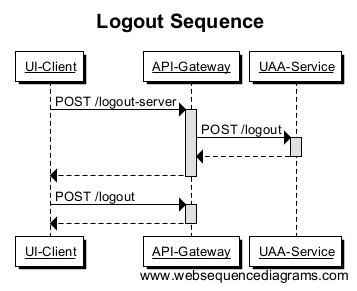

#Common
Contains pcap files of the authentication process and a soup-ui project
# Logout description
There is no specification in oauth which descrips how to logout. Normally that isn't a problem, if you remove the access token in client context you're not longer able to make an authorised api call. But if you use the API-Gateway-Pattern the spring framework will store the refresh-token in the session between gatway an auth-service. So in the case when you invalided the session between ui and gateway it doesn't has an effect to the session between gateway and auth-service. Hence for invalidating all tokens it's necessary to clear the SecurityContext in the gatway and service, see sequence diagram. 

